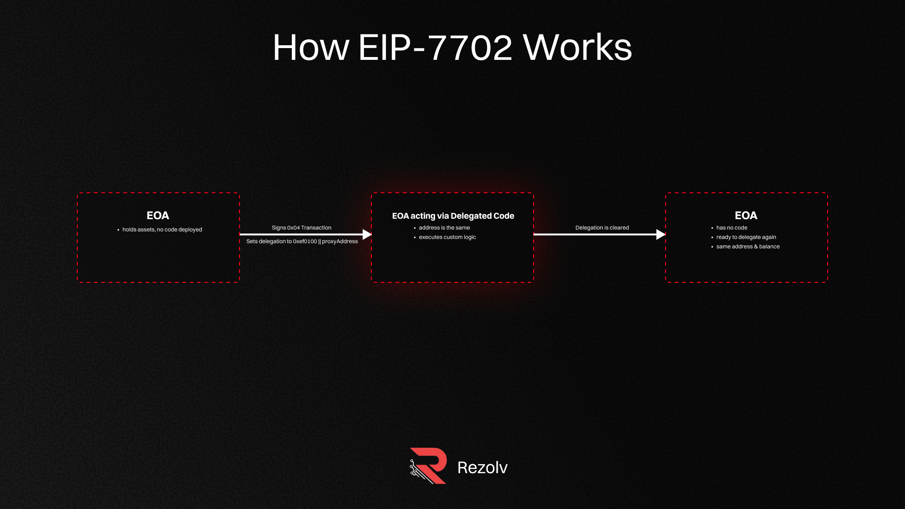
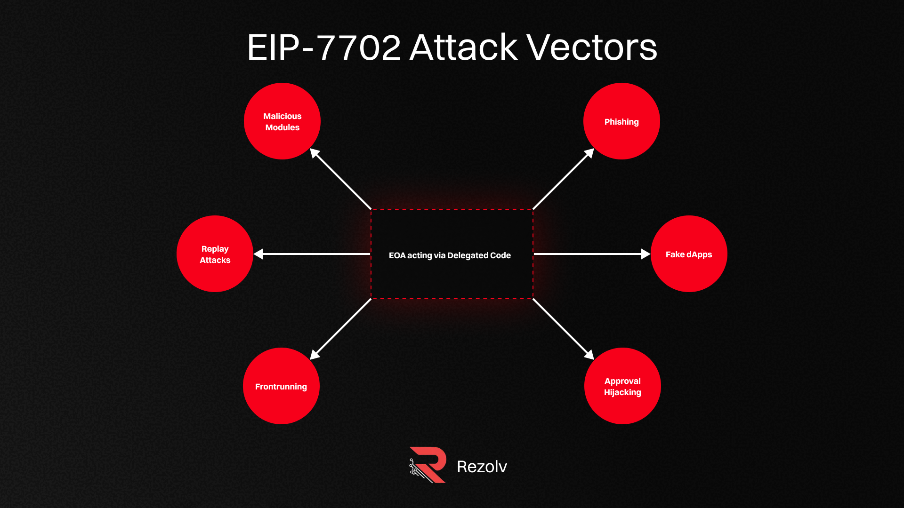

# EIP-7702 Wallet Migrations: Safer UX or New Hacker Playground?

When the Ethereum Pectra upgrade shipped in May 2025, it brought a new feature to the network: EIP-7702. At it's core, EIP-7702 defines a new transaction type that allows a standard [Externally Owned Account (EOA)](https://thirdweb.com/learn/glossary/externally-owned-account-eoa) - the type of wallet most users rely on - to temporarily act like a smart contract by delegating its logic to code stored elsewhere on-chain. This feature unlocks advanced transaction logic, batching, and automation without forcing a permanent migration. When no longer needed, the owner can wipe the delegation by pointing it back to the zero address, instantly restoring the EOA's wallet traditional behavior.

Since its release, developers have started integrating EIP-7702 into DeFi position managers, protocol migration tools, and automated wallet flows. The benefits are clear: smoother User Experience, better composability, and fewer friction points for adoption.

But there's a catch. Giving an EOA temporary contract powers changes its security model on the fly. This creates a brand-new attack surface for malicious actors to exploit.

In this post, we'll break down how EIP-7702 works, what security risks it introduces, real-world attack scenarios, and the key steps both users and builders can take to stay safe now that it's live.

## What EIP-7702 Actually Does

Ethereum's traditional accounts fall into two categories:

-   Externally Owned Accounts (EOAs) - controlled by private keys, capable of signing basic transactions.
-   Smart contract wallets - programmable accounts that can execute complex logic such as multisig, batching, and session keys.

EIP-7702 bridges the gap by allowing an EOA to temporarily deploy and run contract code tied to its address. This enables:

-   Advanced transaction execution, including batching multiple actions into one atomic operation.
-   Automated DeFi workflows such as position migrations, flashloan-powered refinancing, or complex asset swaps.
-   Reversion back to the original EOA state after the advanced logic completes, preserving the user's original wallet address and balance continuity.
-   Safety mechanisms for EOAs - safety mechanisms that lets you regain control if the original private key is lost can be implemented.

The key benefit is seamless UX: users avoid creating new wallet addresses or managing seperate contract wallets, while gaining powerful smart wallet features on demand.

    

## Why it's a Big Deal for Security

EIP-7702 represents a key advancement in Ethereum's move toward account abstraction security - bluring the lines between simple EOAs and programmable smart contract wallets. This temporary transformation of an EOA into a smart contract wallet creates temporary privilege elevation, which fundamentally changes the attack surface. Security implications include:

-   Dynamic state changes - The account's capoabilities and behavior shift mid-transaction, breaking many static security assumptions.
-   Complex signature payloads - More complex transaction data can hide malicious calls or approvals inside legitimate migrations.
-   Tooling gaps - Existing wallet and security tools often don't fully simulate or analyze the migration lifecycle, missing potential exploits.

For auditors, this means migration-related logic needs dedicated, focused reviews - looking beyond normal smart contract code to the transitions in and out of the migration state.

EIP-7702 also introduces smart contract risks to EOAs, which traditionally had a simpler security model focused solely on protecting the private key.

Unlike EOAs, smart contracts have their own complex behaviors - any bug or vulnerability in the contract code can lead to loss of funds. It's crucial to understand that once a contract is deployed or authorized, it has full control over the account's assets, limited only by its own code logic. Moreover, once a smart contract is approved, it remains active until explicitly revoked or deauthorized.

Because attackers can fully simulate smart contract interactions off-chain, exploits tend to be executed immediately and can affect all vulnerable accounts simultaneously, increasing the potential damage.

## Potential Attack Vectors

Since Pectra's rollout, several realistic attack vectors have emerged:

-   Fake dApp Phishing - Malicious applications prompt users to sign migration transactions, claiming integration or rewards, but actually executing hidding asset transfers or approvals.
-   Approval Hijacking - Migration transactions include token approvals that grant attacker-controlled smart contracts permission to drain assets later.
-   Downgrade Exploits - Errors in reverting from the temporary contract state back to the original EOA leave exploitable hooks or inconsistensies.
-   Malicious Migration Modules - Attackers exploit upgradable or third-party modules embedded in migration logic to swap in malicious code post-deployment.

    

## Realistic Scenario

Consider a user migrating their wallet to a temporary contract to move a loan position between protocols. A malicious dApp mimics the legitimate migration interface, tricking the user into signing a crafted migration payload.

Before reverting to the original EOA, the temporary contract executes hidden calls that transfer all ERC-20 balances to attacker-controller addresses. After the migration reverts, the on-chain trace of this contract's activity is minimal, making detection and careful analysis challenging.

## User Safety Checklist

To stay safe when interacting with EIP-7702 migrations, users should:

-   Always verify the source and legitimacy of dApps requesting migration signatures.
-   Avoid approving transactions through unexpected wallet popups, especially on mobile.
-   Review transaction details carefully - check decoded data when available.
-   Be cautios with migration requests to "claim" prompts for small tokens.
-   Store private keys in offline or hardware wallets and only connect the when necessary.

## Developer Mitigation

Builders working with EIP-7702 should implement these best practises:

-   Enforce strict expiry and nonce validation on migration payloads to limit replay risks.
-   Simulate smart contract logic thoroughly in testing enviroments and fuzzers.
-   Avoid or tightly control any upgradable migration modules to prevent injection of malicious code.
-   Educate users on the migration process and potential risks.

## Conclusion

The Pectra update and EIP-7702 represent a significant step forward for Ethereum account abstraction, enabling EOAs to temporarily gain powerful contract capabilities - improving UX and ease of integration accross DeFi.

However, this convenience comes with new security challenges that must be carefully managed. Attackers are already probing this transient state for vulnerabilites, and both users and developers need to be vigilant.

At Rezolv, we believe embracing EIP-7702 safely requires proactive defense, rigorous auditing, and user education. With the right safeguards, this powerful new tool can enhance the Ethereum ecosystem without compromising security.

### TL;DR

-   EIP-7702 lets EOAs temporarily gain smart contract capabilities by delegating execution to on-chain code.
-   This enables powerful features like recovery systems, spending limits, and advanced transaction logic.
-   Security risk increases - your EOA can be compromised if the delegated contract is malicious or has bugs.
-   You can revert to a normal EOA instantly by pointing the delegation back to `address(0)`.
-   Both users and developers need new security habits to prevent approval hijacking, phishing, and logic-level exploits.
